# Cairn

**Orchestrate AI coding agents with full visibility and control.**

Cairn is a desktop app that manages Claude-powered coding agents working on your GitHub issues. Watch Claude plan, implement, and create pull requests—all with live transparency into every step.

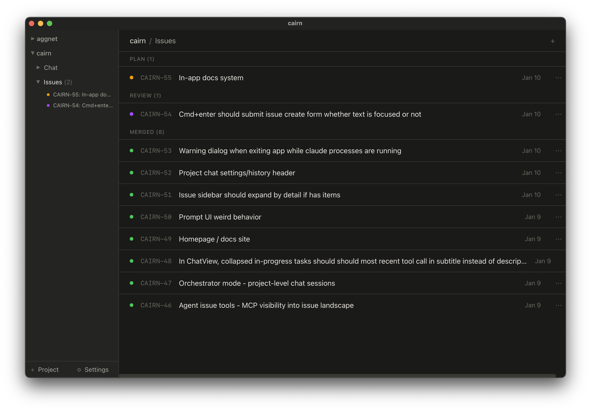
*The main Cairn interface with project navigation, issue tracking, and workflow timeline.*

---

## Features

- **Issue-based workflow** — Structure work as issues that progress through planning → implementation → PR stages
- **Live transcripts** — Watch Claude's reasoning and actions in real-time
- **Isolated implementations** — Each implementation runs in its own git worktree, preventing conflicts
- **Local CI validation** — Run your test suite before PRs are created
- **GitHub integration** — Real-time PR status, CI checks, and merge/close from the app
- **Session continuity** — Pause and resume conversations without losing context
- **Project chat** — Free-form conversations with Claude for exploration and questions

---

## Installation

### Prerequisites

1. **Claude CLI** — Install and authenticate:
   ```bash
   # Install Claude CLI (see claude.ai/code for details)
   claude login
   ```

2. **Git** — Ensure git is installed and configured

### Download

Download the latest release for your platform:

- **macOS (Apple Silicon)**: `Cairn_x.x.x_aarch64.dmg`
- **macOS (Intel)**: `Cairn_x.x.x_x64.dmg`

Open the `.dmg` and drag Cairn to your Applications folder.

---

## Quick Start

### 1. Add a Project

Click **Add Project** in the sidebar and select your git repository folder.

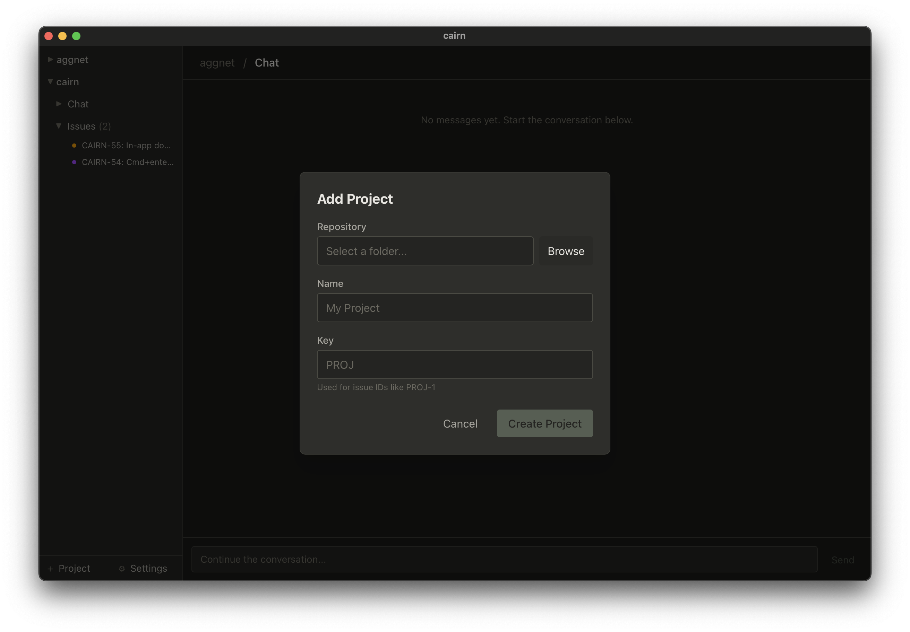
*Cairn auto-detects the project name and creates a short key for issue IDs.*

### 2. Create an Issue

Press `c` or click **New Issue**. Give it a clear title and description—the more context you provide, the better Claude's plan will be.

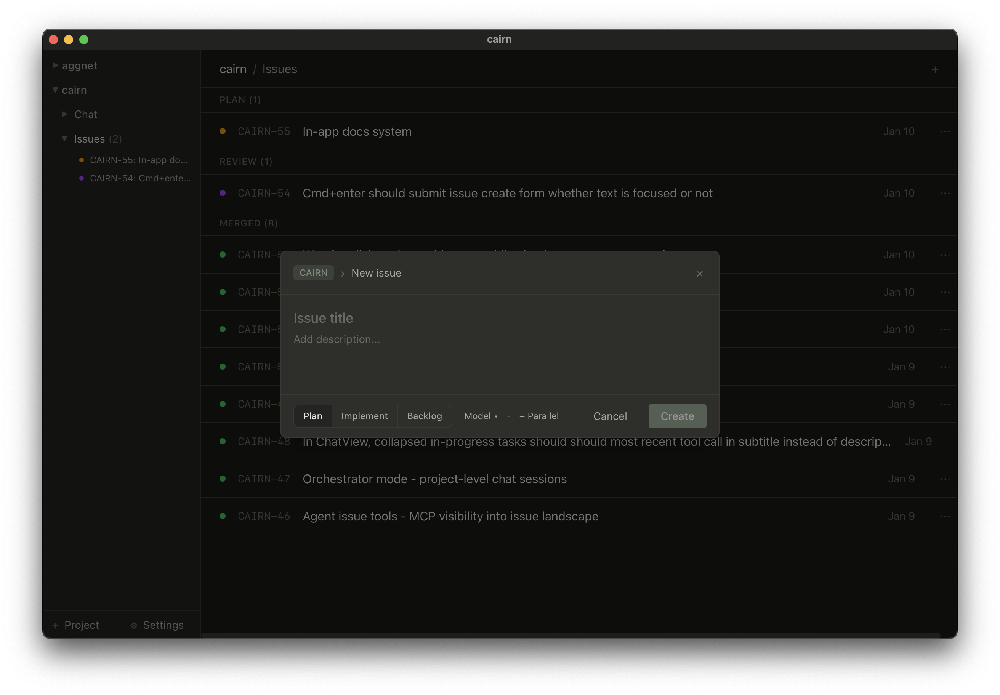
*Create issues with markdown descriptions and optional images.*

### 3. Start Planning

Click **Start Planning** on your issue. Claude explores your codebase and proposes an implementation approach.

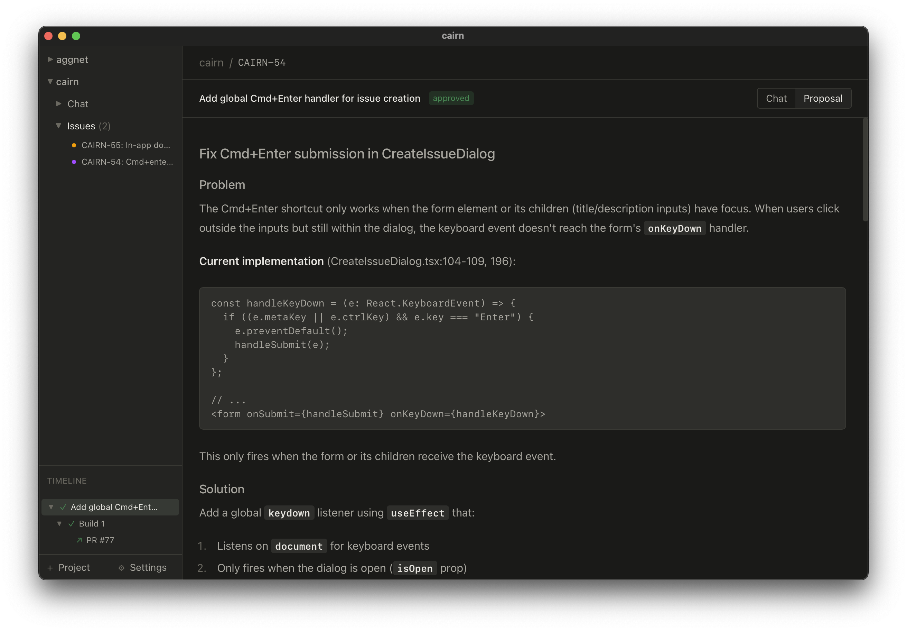
*Claude's plan appears in a structured format. Review before approving.*

### 4. Approve and Implement

When the plan looks good, click **Approve**. Claude begins implementation in an isolated git worktree, with every file change auto-committed.

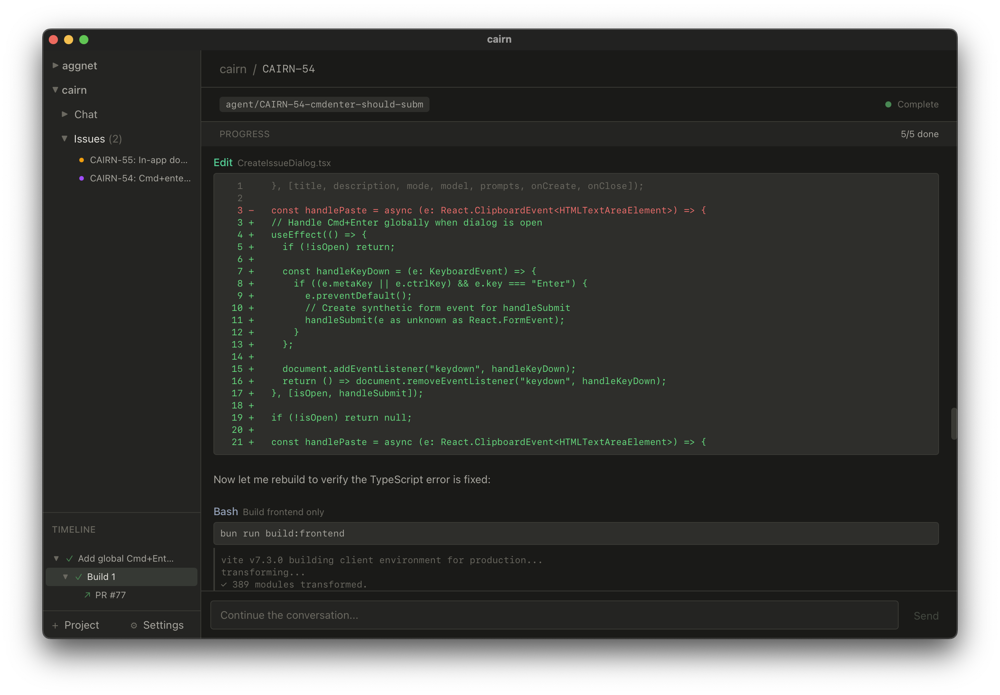
*Watch Claude write and edit files in real-time. Each change is committed automatically.*

### 5. Review the PR

After implementation, Cairn runs your CI commands. If they pass, a PR is created automatically.

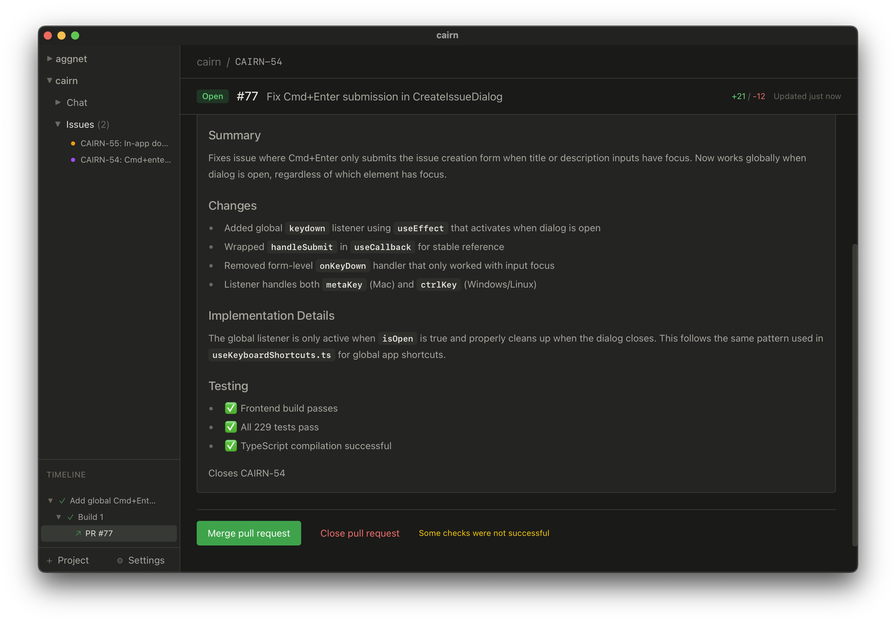
*See PR status, CI results, and merge directly from Cairn.*

---

## Core Concepts

### Projects
Each project connects to a git repository. Projects contain issues and configuration for CI commands, branch naming, and custom prompts.

### Issues
Issues are units of work that progress through stages:
- **Backlog** — Not started
- **Plan** — Claude is planning the approach
- **Build** — Implementation in progress
- **Review** — PR is open
- **Merged** / **Closed** — Complete

### Timeline
Each issue has a timeline showing its work history. The timeline contains nodes:
- **Plan nodes** — Planning sessions with approval status
- **Implementation nodes** — Code changes with branch info
- **PR nodes** — Pull request with GitHub status
- **Chat nodes** — Follow-up conversations

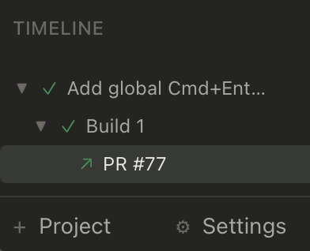
*The timeline tracks all work on an issue, including multiple attempts.*

---

## The Workflow

### Planning Stage

When you start planning, Claude:
1. Reads relevant files in your codebase
2. Explores the problem space
3. Proposes a structured implementation plan

You can:
- **Approve** — Accept the plan and move to implementation
- **Reject** — Discard and try a different approach
- **Request revision** — Ask Claude to modify the plan

If Claude needs clarification, it can pause and ask you questions directly.

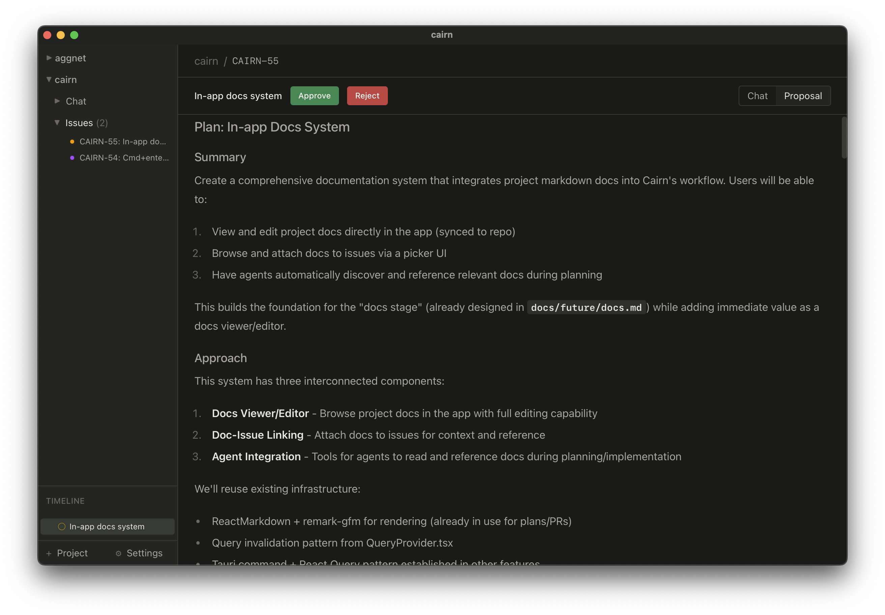
*Review Claude's plan before committing to implementation.*

### Implementation Stage

After approval, Claude:
1. Works in an isolated git worktree (your main branch stays clean)
2. Writes and edits files according to the plan
3. Auto-commits each change with descriptive messages
4. Runs your local CI commands when done

If CI fails, Claude sees the error output and can fix issues before retrying.

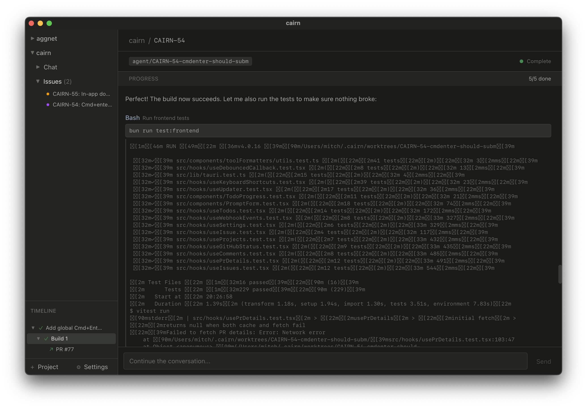
*Local CI runs before creating the PR. Claude can fix failures automatically.*

### PR Stage

When CI passes:
1. The branch is pushed to GitHub
2. A pull request is created
3. Cairn shows real-time status updates

You can merge or close the PR directly from Cairn.

---

## Configuration

Open **Settings** (gear icon or `Cmd+,`) to customize Cairn.

### General

- **Default Model** — Choose between Claude Sonnet (faster) or Opus (more capable)
- **Branch Prefix** — Customize how branches are named (default: `agent/`)

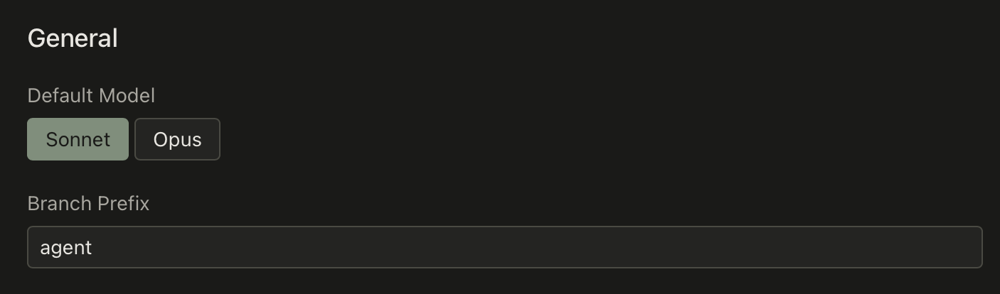
*Configure your default Claude model and branch naming.*

### Project Commands

For each project, you can configure:

- **Setup Commands** — Run once when creating a new worktree (e.g., `bun install`)
- **CI Commands** — Run before PR creation (e.g., `bun run test`, `bun run build`)

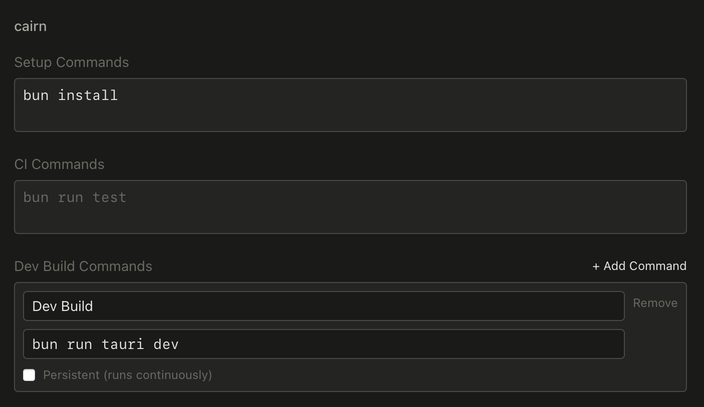
*Add CI commands to validate changes before creating PRs.*

### GitHub Integration

Connect a GitHub App for real-time PR status:

1. Click **Connect GitHub** in Settings → GitHub
2. Follow the browser prompts to create and install the app
3. Select which repositories to enable

Once connected, you'll see:
- PR state (open, draft, merged, closed)
- CI check results with logs
- Review status
- Merge/close buttons


*One-click GitHub App setup—no manual configuration needed.*

### Custom Prompts

Override the default system prompts for planning and implementation phases. Useful for project-specific conventions or requirements.

---

## Keyboard Shortcuts

| Key | Action |
|-----|--------|
| `c` | Create new issue |
| `↑` / `k` | Previous issue |
| `↓` / `j` | Next issue |
| `Enter` | Open selected issue |
| `v` | Toggle chat/plan view |
| `[` / `]` | Previous/next timeline node |
| `Esc` | Close dialog / go back |
| `?` | Show all shortcuts |

---

## Tips

**Write detailed issue descriptions.** The more context you provide—requirements, constraints, relevant files—the better Claude's plan will be.

**Use planning to explore.** Not sure how to approach something? Start a planning session and let Claude investigate. You can always reject and try again.

**Configure CI commands early.** Catching test failures before PR creation saves time. Add your build, lint, and test commands in project settings.

**Pause and resume.** If Claude asks a question or you need to step away, the session can be resumed later with full context preserved.

**Use project chat for exploration.** Before creating an issue, use the project chat to discuss ideas or ask questions about the codebase.

---

## Troubleshooting

**Claude CLI not found**
Ensure Claude CLI is installed and `claude` is in your PATH. Try running `claude --version` in a terminal.

**GitHub webhooks not updating**
Check that the GitHub App is installed on your repository. You can reinstall from Settings → GitHub.

**CI commands failing**
Review your commands in project settings. Commands run in the worktree directory, not your main checkout.

**Session won't resume**
If a session can't be resumed, you can start fresh. Previous context is visible in the transcript history.

---

## Links

- [Report Issues](https://github.com/cairn-dev/cairn-releases/issues)
- [Documentation](https://cairn.dev/docs)

---

*Built with Claude, for Claude.*
